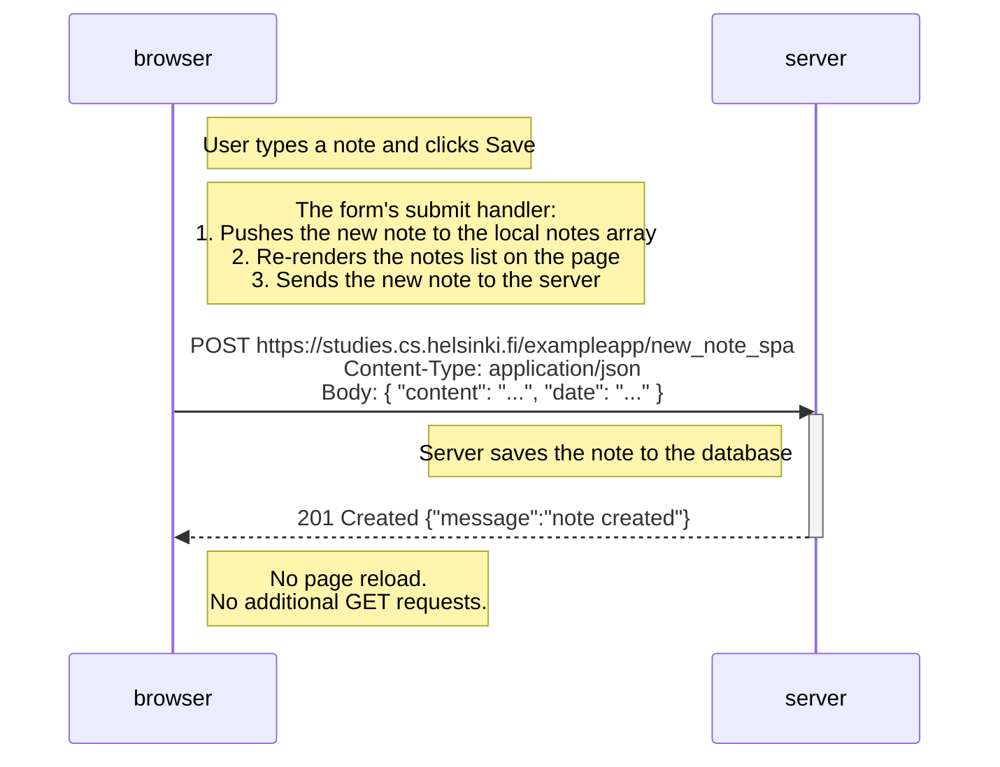

```mermaid
sequenceDiagram
    participant browser
    participant server

    Note right of browser: User types a note and clicks Save

    Note right of browser: The form's submit handler:<br/>1. Pushes the new note to the local notes array<br/>2. Re-renders the notes list on the page<br/>3. Sends the new note to the server

    browser->>server: POST https://studies.cs.helsinki.fi/exampleapp/new_note_spa<br/>Content-Type: application/json<br/>Body: { "content": "...", "date": "..." }
    activate server
    Note left of server: Server saves the note to the database
    server-->>browser: 201 Created {"message":"note created"}
    deactivate server

    Note right of browser: No page reload.<br/>No additional GET requests.
```